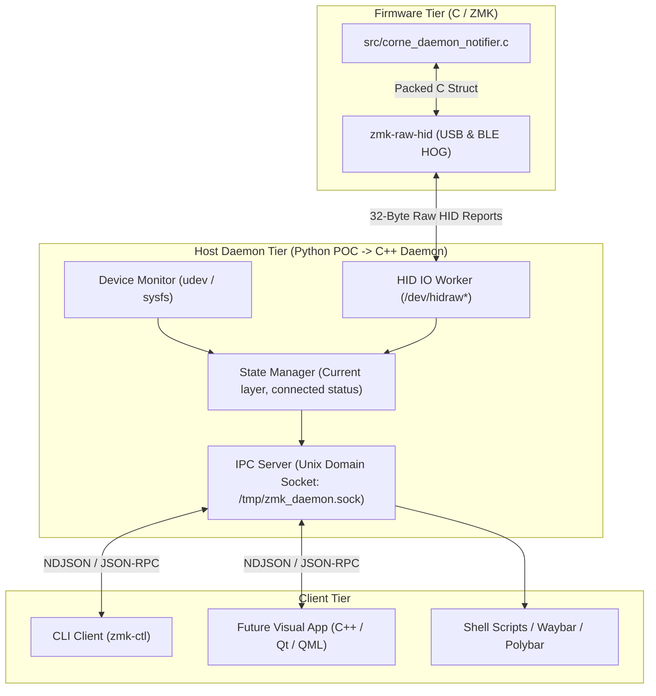

# Architecture & Implementation Plan: ZMK Host Daemon Integration

## Goal Description
The objective is to establish bidirectional communication between the **Eyelash Corne** keyboard (running ZMK firmware) and a Linux host daemon, mimicking the **ZSA Voyager / Moonlander** (`Keymapp` daemon + `Kontroll` CLI) experience:
1. Detect keyboard **connected / disconnected** states in real time.
2. Send the **active layer number AND human-readable layer name** directly from the keyboard firmware across Raw HID (USB & Bluetooth).
3. Ensure **zero hardcoding** in the host daemon: layer names are sourced directly from Devicetree (`display-name = "..."`) or runtime settings.
4. Structure the host code cleanly so that transitioning from this Python POC to a **C++ daemon and C++/Qt/QML GUI** in the future is seamless and requires zero protocol rewrites.

---

## Repository Structure & Project Organization

### Comparison: Separate Repo vs. Subdirectory in this Repo

| Approach | Structure | Pros | Cons | Recommendation |
|---|---|---|---|---|
| **A. Separate Repository (`corne-daemon` or `zmk-companion`)** | Dedicated repo alongside `zmk-new_corne` | • Clean decoupling between embedded firmware (Zephyr/west) and host desktop software (Python now, C++/Qt/CMake later).<br>• Independent CI/CD, issue tracking, and packaging (systemd, deb, Flatpak).<br>• Board-agnostic: daemon can support any future ZMK keyboard running this protocol. | Requires switching between two git repos during initial POC development. | **Recommended for long-term & C++/Qt path** |
| **B. Subdirectory in this Repo (`host/`)** | `zmk-new_corne/host/` | • Zero setup overhead for POC: single clone, atomic commits.<br>• Easy testing of firmware + host in one workspace. | Blends firmware repo with desktop code; requires adding `host/**` to `paths-ignore` in GitHub Actions. | Good for quick scratchpad / initial 1-hour test |

> [!TIP]
> **Recommended Path**:
> 1. Create a dedicated directory/repository: `/home/andrii/Projects/pet/zmk-daemon` (or `corne-daemon`).
> 2. Share a single protocol definition document / C header file between both projects.
> 3. Keep the ZMK config repo focused purely on firmware.

---

## Architectural Layering (Designed for Future C++ / Qt Transition)

To make replacing the Python POC with C++ and Qt/QML effortless, we decouple the system into three distinct tiers:



### Why this 3-tier design pays off for C++ & Qt:
1. **The GUI Never Touches Raw HID**: The Qt/QML visual app will **not** need root permissions, `/dev/hidraw` file descriptors, or USB polling loops. It simply connects to the local Unix Domain Socket (using `QLocalSocket`) and receives clean JSON events.
2. **Identical Wire Protocol**: The binary format over Raw HID is defined as a standard packed struct. In Python, we decode it with `struct.unpack('<BBI16s')`; in C++, it maps directly to `struct __attribute__((packed)) LayerStatePacket`.
3. **Language Independence**: When you rewrite the daemon in C++ (e.g. using `libhidapi` + `libudev` + `QLocalServer` or `asio`), the CLI and GUI protocols remain 100% identical.

---

## Protocol Specification

### 1. Wire Format (Raw HID 32-Byte Packed Struct)

Defined in C as:
```c
struct __packed zmk_raw_report {
    uint8_t  msg_type;      /* 0x01: MSG_LAYER_STATE */
    uint8_t  layer_index;   /* Active layer index (0, 1, 2...) */
    uint32_t layer_state;   /* 32-bit active layer bitmask */
    uint8_t  name_len;      /* Length of the layer name string */
    char     name[16];      /* Null-terminated ASCII name ("QWERTY", "NAV"...) */
    uint8_t  reserved[9];   /* Zero padding for 32-byte report size */
};
```

### 2. IPC Protocol (Unix Domain Socket: `/tmp/zmk_daemon.sock`)
Newline-delimited JSON (NDJSON) streaming:

**Events emitted by Daemon to Clients:**
```json
{"event": "connected", "device": "Eyelash Corne", "transport": "bluetooth"}
{"event": "layer_changed", "index": 2, "name": "NAV", "state_mask": "0x00000004"}
{"event": "disconnected"}
```

**Commands sent by Clients to Daemon:**
```json
{"cmd": "get_status"}
```

---

## Proposed Project Layouts

### 1. Firmware Repository (`/home/andrii/Projects/pet/zmk-new_corne`)

```text
zmk-new_corne/
├── CMakeLists.txt              # [NEW] Adds app sources
├── Kconfig                     # [NEW] Config options for notifier
├── zephyr/
│   └── module.yml              # [MODIFY] Enables CMake and Kconfig
├── src/
│   └── corne_daemon_notifier.c # [NEW] C event listener hooking layer state & raw HID
├── config/
│   ├── west.yml                # [MODIFY] Includes zzeneg/zmk-raw-hid
│   ├── eyelash_corne.conf      # [MODIFY] Enables CONFIG_RAW_HID=y
│   └── eyelash_corne.keymap    # Existing display-name definitions
└── build.yaml                  # [MODIFY] Adds raw_hid_adapter to central shield
```

### 2. Host Daemon Repository (`/home/andrii/Projects/pet/zmk-daemon`)

```text
zmk-daemon/
├── README.md
├── 99-eyelash-corne.rules      # Udev rules for /dev/hidraw permissions
├── requirements.txt            # pyudev, hidapi (or pure Linux sysfs/posix)
├── zmk_daemon/
│   ├── __init__.py
│   ├── protocol.py             # Binary packet unpacker & message definitions
│   ├── hid_transport.py        # /dev/hidraw scanner and reader loop
│   ├── ipc_server.py           # Unix domain socket server
│   └── daemon.py               # Main orchestrator & connection manager
└── zmk_ctl.py                  # CLI tool ("kontroll" equivalent: listen, status)
```

*(When later transitioning to C++, this directory will host the CMake project with `src/daemon/` and `src/gui_qt/`)*.

---

## Verification Plan

### Step 1: Firmware Build & Flash
1. Update `west.yml`, `build.yaml`, `zephyr/module.yml`, and add `src/corne_daemon_notifier.c`.
2. Push commit to trigger GitHub Actions build.
3. Download `eyelash_corne_left` UF2 and flash.
4. Remove Bluetooth pairing on host (`bluetoothctl remove F6:46:3B:D4:C4:1A`) and re-pair so the new Raw HID GATT descriptor is recognized.

### Step 2: Host Daemon Verification
1. Install udev rule:
   ```bash
   sudo cp 99-eyelash-corne.rules /etc/udev/rules.d/
   sudo udevadm control --reload-rules && sudo udevadm trigger
   ```
2. Launch Python daemon:
   ```bash
   python3 -m zmk_daemon.daemon
   ```
3. Observe initial connection output:
   - Daemon logs `Found Eyelash Corne at /dev/hidraw6`.
   - Sends query `[0x01]` and receives `{"event": "layer_changed", "index": 0, "name": "QWERTY"}`.
4. Press layer switch keys on the keyboard (`NUMBER`, `NAV`, `SYS`, `FN`, `GAME`):
   - Daemon immediately displays the new layer index and name.
5. In another terminal, run:
   ```bash
   python3 zmk_ctl.py listen
   ```
   Verify events stream live through the Unix domain socket.
